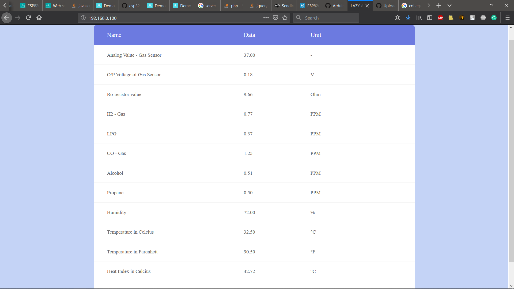

# Lazy_Analytic_home
College DBMS-Project

## Web-site

In ESP32 NodeMCU we create two pages on server. First that loads as normal webpage and second webpage is behind the scene i.e. AJAX.
In NodeMCU index.h header file contains Local Hosted HTML file.

Sensor Data Will updata automaic **(No need To Refresh)** after 2 second.

### Technology Used in Website
1)  HTML5
2)  CSS
3)  AJAX
  

## NodeMCU (ESP8266)

NodeMCU is an open source IoT platform. It includes firmware which runs on the ESP8266 Wi-Fi SoC from Espressif Systems, and hardware which is based on the ESP-12 module.

### Code
#### Header File
<a href="Images/HeaderFile.svg">Header File Carbon Code</a>
#### ino file
<a href="Images/carbon.svg">NodeMcu (.ino) carbon code</a>
