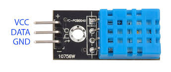
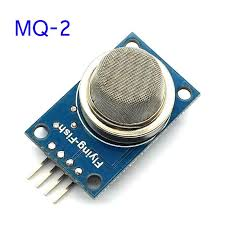
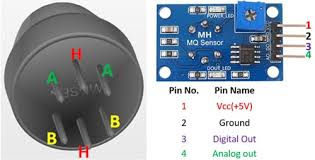

# Lazy_Analytic_home
College DBMS-Project

## Web-site

In ESP32 NodeMCU we create two pages on server. First that loads as normal webpage and second webpage is behind the scene i.e. AJAX.
In NodeMCU index.h header file contains Local Hosted HTML file.

Sensor Data Will updata automaic **(No need To Refresh)** after 2 second.

### Technology Used in Website
1)  HTML5
2)  CSS
3)  AJAX
  

## NodeMCU (ESP8266)

NodeMCU is an open source IoT platform. It includes firmware which runs on the ESP8266 Wi-Fi SoC from Espressif Systems, and hardware which is based on the ESP-12 module.

### Used Pin
#### A0(ADC0) : for MQ-2 Sensor Data Input
#### D5(GPIO14) : for DHT11 Sensor Data Input

## Used Sensor
### DHT11

The DHT11 is a basic, ultra low-cost digital temperature and humidity sensor. It uses a capacitive humidity sensor and a thermistor to measure the surrounding air, and spits out a digital signal on the data pin (no analog input pins needed). Its fairly simple to use, but requires careful timing to grab data.

### MQ-2

Gas Sensor(MQ2) module is useful for gas leakage detection (home and industry). It is suitable for detecting H2, LPG, CH4, CO, Alcohol, Smoke or Propane. Due to its high sensitivity and fast response time, measurement can be taken as soon as possible. The sensitivity of the sensor can be adjusted by potentiometer.

### Code
#### Header File
<a href="Images/HeaderFile.svg">Header File Carbon Code</a>
#### ino file
<a href="Images/carbon.svg">NodeMcu (.ino) carbon code</a>
